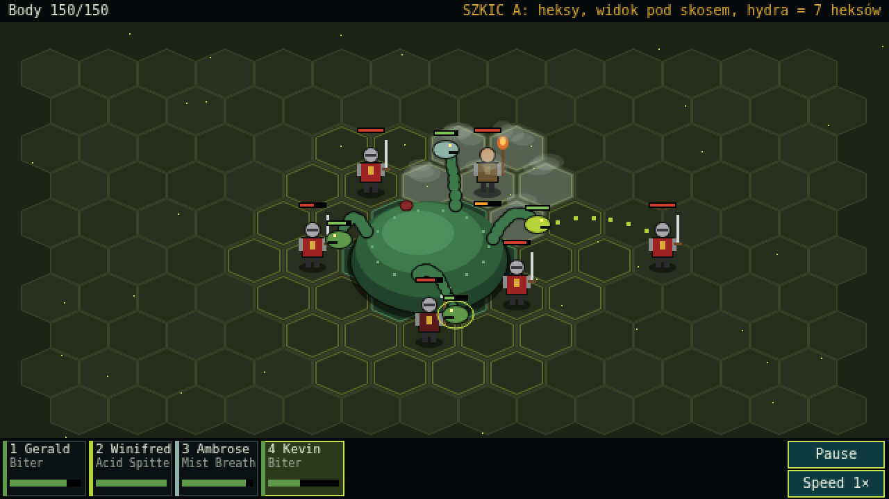
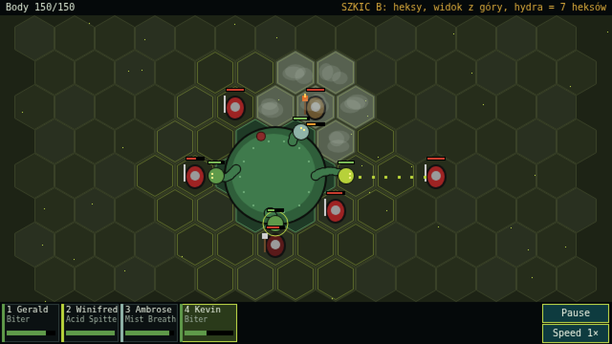
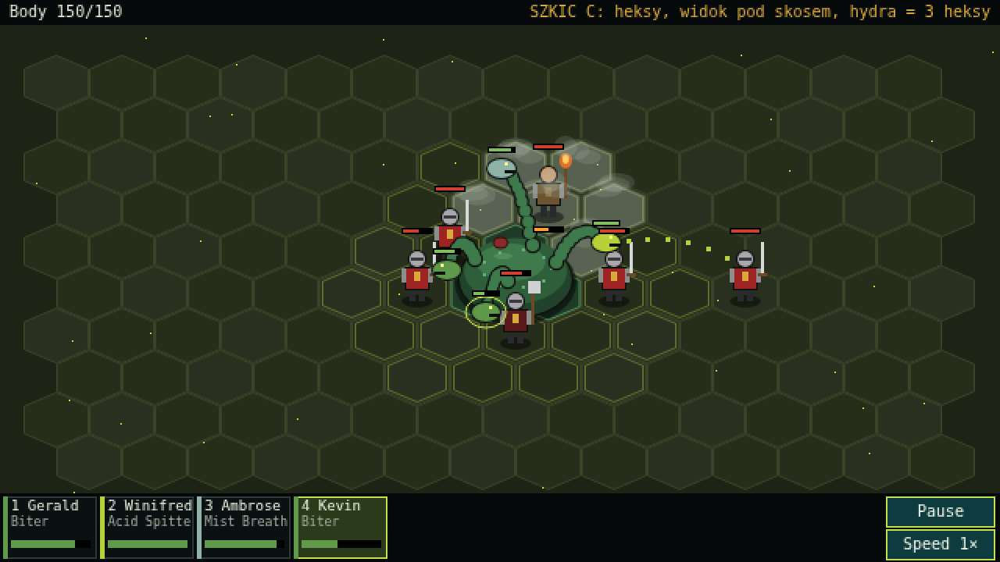
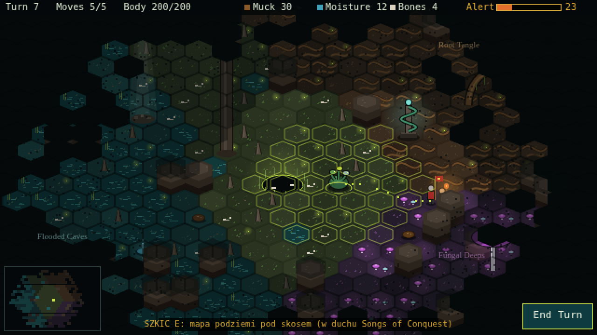

# Szkice bitwy na heksach (2026-09-30)

Rysunki poglądowe do decyzji o przebudowie bitwy po playteście M1. **To nie jest gra**: kształty są zastępcze, szkice pokazują tylko skalę, układ i kąt widzenia.

Na każdym szkicu jest ta sama sytuacja: hydra w środku, sześciu ludzi Zakonu dookoła, cztery głowy w akcji.

- żółtawe obwódki heksów: zasięg szyi (dokąd można posłać wybraną głowę),
- jasne heksy: chmura Mist,
- pomarańczowy pasek przy Torchbearerze: przypalanie kikuta,
- kropki: kwas w locie.

## A: widok pod skosem, hydra na 7 heksach

## B: widok z góry, hydra na 7 heksach

## C: widok pod skosem, hydra na 3 heksach

## E: mapa podziemi pod skosem (do planu M2b, 2026-10-01)

Kierunek dla mapy w duchu Songs of Conquest: te same spłaszczone heksy co w bitwie, biomy (Flooded Caves, Root Tangle, Fungal Deeps i bagno wokół leża), obiekty stojące na mapie (leże, kapliczka Wielkiego Węża, patrol ze sztandarem, złoża, skrzynia, snop światła z przejścia na powierzchnię), mgła wojny, zasięg ruchu, zasoby u góry i minimapa.

